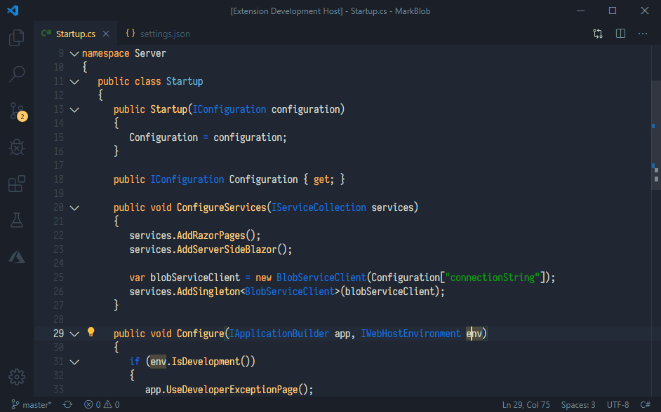
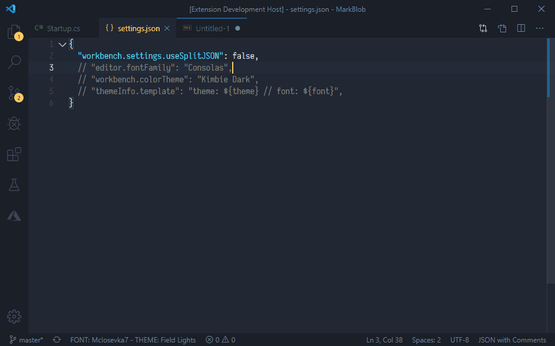
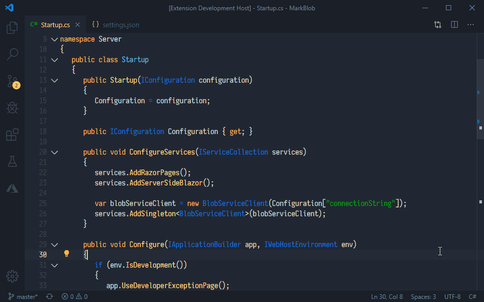
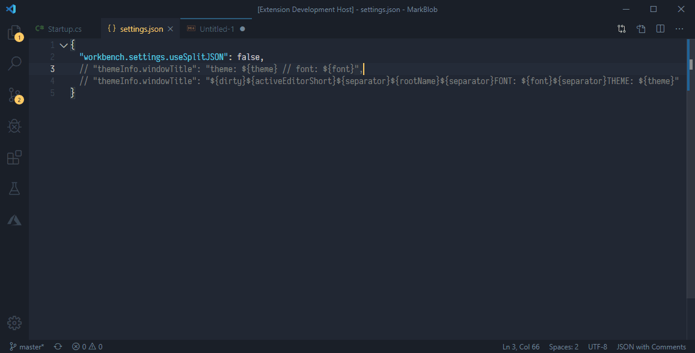

Display your current Theme and Font in the Status Bar, Window Title, or a popup to preemptively answer the inevitable 'What Font/Theme is that ?' questions when doing screen captures or live streaming.

# Usage

ThemeInfo introduces two variables: ${font} and ${theme}.  The `themeInfo.template` setting is a template that you can include either variable in.  It is used for the status bar, popup, and "Add Info to Window Title" command.  The default is `"FONT: ${font} - THEME: ${theme}"`.

## Popup

Hit `F1` => `ThemeInfo: Show Info` to display a popup with font/theme info.

## Status Bar

The status bar entry can be hidden by setting `themeInfo.template` to `""` or right-clicking in the status bar and deselecting `ThemeInfo`.

## Window Title

Hit `F1` => `ThemeInfo: Add Info to Window Title (...)` to add font/theme info to your Window Title.  This reads your current `window.title` setting and appends `themeInfo.template`, saving the result to `themeInfo.windowTitle` so it will automatically update if you make any changes to your font or theme.

You can also edit the `themeInfo.windowTitle` template setting directly and include `${font}` and `${theme}` to overwrite `window.title`.  It will then keep your `window.title` up to date if you make any font/theme changes.  It's empty by default so as to not overwrite any existing customizations to `window.title`.  Note that if you clear this setting or uninstall/disable the extension, the font/theme text will remain in your `window.title` setting.  An example template would be `"${dirty}${activeEditorShort}${separator}${rootName}${separator}FONT: ${font}${separator}THEME: ${theme}"`

Built in `window.title` variables:

`${activeEditorShort}`: the file name (e.g. myFile.txt).

`${activeEditorMedium}`: the path of the file relative to the workspace folder (e.g. myFolder/myFileFolder/myFile.txt).

`${activeEditorLong}`: the full path of the file (e.g. /Users/Development/myFolder/myFileFolder/myFile.txt).

`${activeFolderShort}`: the name of the folder the file is contained in (e.g. myFileFolder).

`${activeFolderMedium}`: the path of the folder the file is contained in, relative to the workspace folder (e.g. myFolder/myFileFolder).

`${activeFolderLong}`: the full path of the folder the file is contained in (e.g. /Users/Development/myFolder/myFileFolder).

`${folderName}`: name of the workspace folder the file is contained in (e.g. myFolder).

`${folderPath}`: file path of the workspace folder the file is contained in (e.g. /Users/Development/myFolder).

`${rootName}`: name of the workspace (e.g. myFolder or myWorkspace).

`${rootPath}`: file path of the workspace (e.g. /Users/Development/myWorkspace).

`${appName}`: e.g. VS Code.

`${remoteName}`: e.g. SSH

`${dirty}`: a dirty indicator if the active editor is dirty.

`${separator}`: a conditional separator (" - ") that only shows when surrounded by variables with values or static text.

Eventually, maybe, `${font}` and `${theme}` will be built in variables and this somewhat hacky solution can go away 😀